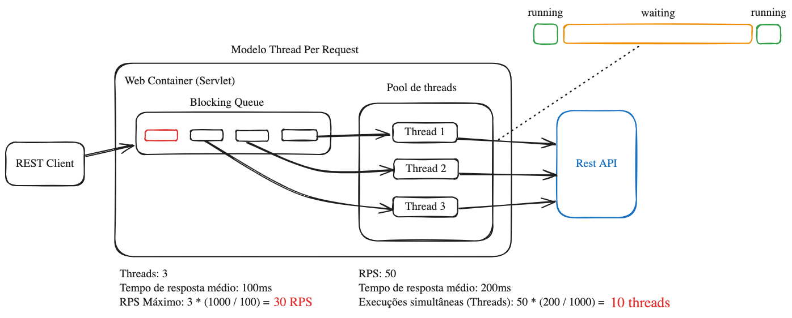
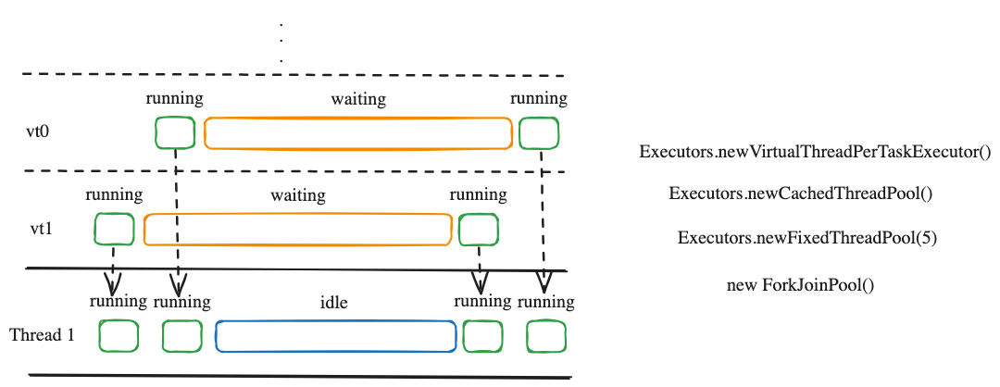

## Qual a capacidade do seu microserviço?

A capacidade de um microserviço está diretamente relacionada ao número máximo de requisições que ele consegue processar sem degradar sua performance. 
Fatores como uso de CPU, memória, concorrência, latência de dependências externas e estratégias de escalabilidade influenciam no seu desempenho. Medir e otimizar esses aspectos é essencial para garantir um serviço eficiente e resiliente.

## Testes de performance

Testes de performance são essenciais para identificar gargalos antes que impactem usuários finais. 
Avaliar a capacidade do microserviço apenas em produção pode resultar em falhas críticas, altos custos e perda de confiança no sistema. 
Simular cenários reais em ambiente controlado permite ajustes antecipados, garantindo escalabilidade e estabilidade.

## Tecnologias Utilizadas

### Ferramentas de Teste de Performance
- Docker
- k6
- Grafana
- Prometheus
- InfluxDB
- Java App Mock
- Mission Control
- VisualVM

### Microserviço Spring
- Java 21
- Spring Boot 3.4
- Kotlin 1.9.0
- Open Feign
- WebFlux (Reactor)
- Micrometer + Prometheus
- PostgreSQL
- Undertow

## Estratégias utilizadas
- Dashboard consolidando métricas K6 + Micrometer
- Experimentar diferentes configurações
- Limitar recursos nos containers
- Manter a máquina ligada durante os testes
- Json User mockado com 20 atributos
- Operação em memõria (n2) com um array de UUID de 100 elementos
- Busca em uma tabela no RDS usando a pk como filtro com UUID gerados randomicamente
- Tabela com 10000 registros
- Uso de HTTPS impacta o consumo de CPU devido ao processo de criptografia
- Configuração inicial do Java App: 2 vCPU e 1GB de memória
- Testes realizados com apenas 1 container para avaliar a capacidade unitária do microserviço

## Ambiente testes vs real
- Latência adicional de rede AWS ~7ms
- Datadog Agent adiciona 20% ao uso de CPU
- Importante testar múltiplas tasks/pods em ambiente AWS e validar auto-scaling


## SHOW ME THE TESTS
<br>
<br>
<br>

<br>
<br>
<br>
<br>


## Requisitos Não Funcionais (SLO)
- DAU (Daily Active Users)
- Throughput
- RPS Médio
- RPS Pico
- Tempo de resposta (p95, latência)
- Mínimo 2 tasks/pods para ter Alta Disponibilidade

### Importância dos Percentis na Latência

O p95 (percentil 95) é uma métrica estatística usada para medir a latência de uma API ou sistema.
Ele representa o tempo máximo de resposta dentro do qual 95% das requisições são realizadas.

```plaintext
Latências: [100ms, 110ms, 105ms, 120ms, 150ms, 180ms, 2500ms]
Média = 463,57ms
Percentil 95 (p95) = **2500ms**
```

### Tempo de resposta e/ou Throughput

Se a prioridade for garantir uma experiência rápida para o usuário, o tempo de resposta (latência) é essencial. 
Já se o foco for processar o máximo de requisições possível, o throughput (RPS) deve ser priorizado. 
O ideal é encontrar um equilíbrio, garantindo baixa latência sem comprometer a capacidade de processamento.

## MORE TESTS
<br>
<br>
<br>

<br>
<br>
<br>
<br>

## Threads

### Pool de Threads


### Virtual Threads


## FinOps
- O Fargate custa em mẽdia R$ 320,00 / vCPU
- Hoje temos 34 microserviços na nossa conta AWS

## Possíveis Soluções
- Otimizar os parâmetros da JVM
- Spring Native + GraalVM

## TROUBLESHOOTING
<br>
<br>


<br>

<br>
<br>
<br>
<br>

## Observabilidade 

### Four Golden Signals

Latência – Tempo de resposta das requisições. Mede quanto tempo um sistema leva para processar e responder a uma solicitação.

Tráfego – Volume de requisições ou dados recebidos pelo sistema, podendo ser medido em RPS (Requests Per Second) ou em taxa de transferência de dados.

Erros – Taxa de falhas no sistema, como respostas HTTP 5xx, timeouts ou exceções.

Saturação – Quanto o sistema está próximo do seu limite de capacidade, como uso de CPU, memória ou conexões ativas.

## Gargalos
Gargalos ocorrem quando um recurso limita o desempenho do sistema. Entre os principais estão pool de conexões, CPU, memória, full scans em banco de dados e dependências externas como APIs e filas. Além disso, a má configuração do pool de threads pode causar contenção e aumentar a latência. Exemplos:

- Pool de conexões
- CPU
- Memória
- Full Scan
- Serviços de terceiros
    - Apis
    - Banco de dados
    - SNS/SQS
    - Kafka*
- **Pool de threads**

### IOBound x CPUBound

Uma aplicação IO-Bound é limitada pela velocidade de operações de entrada e saída, como chamadas a APIs e acessos a bancos de dados, enquanto uma aplicação CPU-Bound é restringida pela capacidade de processamento, como cálculos intensivos e compressão de arquivos. Em sistemas IO-Bound, otimizações geralmente envolvem concorrência, assincronismo e caching, enquanto em sistemas CPU-Bound, o foco está em paralelismo, uso eficiente de múltiplos núcleos e, quando aplicável, processamento em GPU. Identificar corretamente o tipo de gargalo é essencial para aplicar a estratégia de otimização adequada.

**Threads em estado waiting ou blocked não consomem CPU ativamente, pois estão aguardando a liberação de um recurso ou a conclusão de uma operação externa. Durante esse tempo, a CPU pode ser utilizada por outras threads em execução, otimizando o uso dos recursos do sistema.**

## Configurações do script de teste

- VUs x RPS
- Rampa
- Calculo de execuções simultâneas

### Calculo de execuções simultâneas

**Cálculo de Execuções Simultâneas**:

$$
\text{Execuções Simultâneas} = \frac{\text{RPS} \times \text{Tempo Médio de Resposta (ms)}}{1000}
$$

**Exemplo**:  
Se um sistema recebe **400 RPS** e o **tempo médio de resposta** é **420ms**:

$$
\text{Execuções Simultâneas} = \frac{400 \times 420}{1000} = 168
$$

Isso significa que, em média, **168 requisições estarão sendo processadas ao mesmo tempo**.

### Thread-per-request
No modelo Thread-Per-Request, cada requisição recebe uma thread dedicada até sua conclusão. No Java/Spring, isso é gerenciado pelo pool de threads, garantindo concorrência. No entanto, quando há muitas requisições simultâneas, o consumo de memória e o overhead de gerenciamento de threads podem se tornar um gargalo.

## Benchmarks de performance
- Tomcat x Undertow
- IO Blocking x IO NonBlocking (Reactive)
- Threads x Coroutines (Light threads)

## Assincronismo, Paralelismo e Concorrência

- **Assincronismo**: Permite que uma tarefa continue sem esperar outra finalizar. 
- **Paralelismo**: Executa múltiplas tarefas simultaneamente, aproveitando múltiplos núcleos da CPU. 
- **Programação** concorrente: Gerencia várias tarefas ao mesmo tempo, mas nem sempre as executa simultaneamente, apenas alterna entre elas para otimizar o uso dos recursos.

___

## Estratégia de Testes

### Meta
- RPS Inicial: 250
- RPS Final: 500
- 2 chamadas de API síncronas de 100ms

### Configuração Vencedora
- Web Container: Undertow
- Threads Virtuais: false
- Threads: 200
- CPU: 2 vCPU
- Memória: 1GB
- Parâmetros JVM: não aplicados

___

## Observações
- Aumento para 200 threads de plataforma não impacta o tempo de resposta, mesmo com aumento no RPS
- Pico de CPU de 56% ao dobrar o RPS, estabilizando em 30%

### Mock
- Suporta até 3000 RPS com no máximo 10ms de overhead

### Primeira Requisição (First Request)
- Overhead 5x maior ao usar objetos serializados, possivelmente causado por lazy loading do Spring + reflection + JIT

### Configuração de Teste no K6
- 4 minutos com metade do RPS alvo
- 5 minutos com RPS na meta
- 2 minutos de pico com 20% acima da meta

### Metas
- Throughput: 400 RPS
- p95: 420ms
- SSL: true
- Uso de CPU: 60%
- Uso de Memória: 60%
- Pico de 50%

### Comparação entre Fargate e EKS
- **Fargate** aloca no mínimo 2x a memória para cada 1x vCPU
- **EKS** permite variação dinâmica de CPU e memória, funcionando como auto-scaling vertical

### Cuidados ao Executar Testes
- Reiniciar a aplicação antes de cada teste para evitar otimizações do JIT e forçar cenário de produção.
- Aumentar o RPS gradualmente

### Latência em Ambiente AWS
- Latência média de 7ms para cada chamada de API REST

### Impacto do Alto Acoplamento em Microserviços
- Dependências com tempos de resposta variáveis degradam a performance

### Estratégias de Auto-Scaling
- Auto-scaling baseado apenas em CPU/memória pode ser ineficiente

### Configuração de VUs no K6
- Número máximo de VUs deve refletir execuções simultâneas esperadas
- Preferir `progressive vus` ao invés de `progressive rps`

### Testes com Programação Reativa
- Pico de 500 RPS no `progressive_rps`
___


## Comandos Úteis

### Monitoramento de Containers
```bash
docker stats --format "table {{.Name}}\t{{.CPUPerc}}\t{{.MemPerc}}\t{{.MemUsage}}"
```

### Parâmetros JVM Testados
```bash
java -XX:+UnlockDiagnosticVMOptions -XX:+LogTouchedMethods -jar target/iobound-thread-app-0.0.1-SNAPSHOT.jar
java -Xshare:off -XX:+UnlockDiagnosticVMOptions -XX:+LogTouchedMethods -jar target/iobound-thread-app-0.0.1-SNAPSHOT.jar > classlist.txt
java -Xshare:dump -XX:SharedClassListFile=classlist.txt -XX:SharedArchiveFile=spring-cds.jsa -jar target/iobound-thread-app-0.0.1-SNAPSHOT.jar
java -Xshare:on -XX:SharedArchiveFile=spring-cds.jsa -jar target/iobound-thread-app-0.0.1-SNAPSHOT.jar
java -Dspring.aot.enabled=true -jar target/iobound-thread-app-0.0.1-SNAPSHOT.jar
```

### Ajustes de Performance na JVM
```bash
-XX:MaxRAMPercentage=75
-XX:+UseParallelGC
-XX:MaxGCPauseMillis=200
-XX:GCTimeRatio=9
-XX:+UseStringDeduplication
-XX:SurvivorRatio=4
-XX:ParallelGCThreads=2
-XX:NewRatio=1
-XX:+UseAdaptiveSizePolicy
-XX:MaxHeapFreeRatio=100
```

### Geração de Certificado
```bash
keytool -genkeypair -alias mycert -keyalg RSA -keysize 2048 -storetype PKCS12 \
-keystore keystore.p12 -validity 3650 \
-dname "CN=localhost, OU=Dev, O=Company, L=City, ST=State, C=BR" \
-storepass changeit -keypass changeit
```

### Copiar Certificados do Container para a Máquina Local
```bash
docker cp java_app_mock:/app/certs/. ./certs
```

___

## Próximos Passos
- Incluir chamadas ao DynamoDB
- Incluir Datadog Agent
- Testar GraalVM

